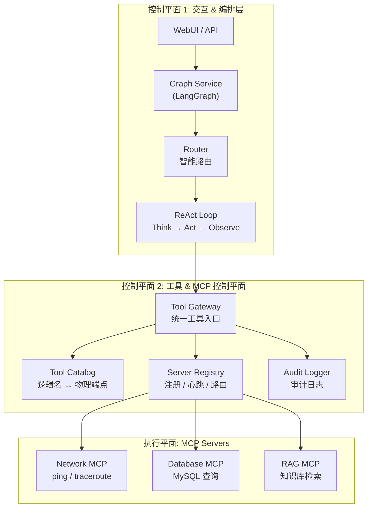
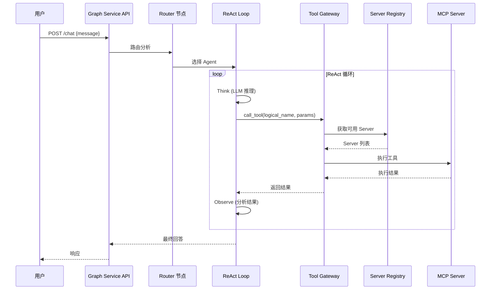

# NSSA AI Agent Platform

**企业级 AI Agent 智能运维平台** - 基于 LangGraph + MCP 协议的多 Agent 编排系统

## 📋 项目简介

NSSA AI Agent Platform 是一个面向企业运维场景的智能 Agent 平台，采用"2 个控制平面 + 1 个执行平面"的架构设计，支持多 Agent 协作、工具统一调度、动态负载均衡等企业级特性。

### 核心特性

- 🤖 **多 Agent 协作**：Router 智能路由 + ReAct 推理循环
- 🔧 **统一工具网关**：逻辑工具名抽象，Agent 无需感知物理端点
- 📡 **MCP 协议支持**：标准化的工具调用协议
- ⚖️ **动态负载均衡**：轮询、权重、一致性哈希等路由策略
- 📊 **审计日志**：完整的工具调用追踪
- 🔄 **配置热加载**：运行时动态更新配置
- 🔌 **多 LLM Provider**：支持 Ollama/OpenAI/Gemini/DeepSeek

## 🏗️ 系统架构



### 架构说明

| 层级 | 组件 | 职责 |
|------|------|------|
| **控制平面 1** | Graph Service | Agent 编排、会话管理、LangGraph 状态机 |
| | Router | 智能路由，根据用户意图选择 Agent |
| | ReAct Loop | Think → Act → Observe 推理循环 |
| **控制平面 2** | Tool Gateway | 统一工具调用入口 `call_tool(logical_name, params)` |
| | Tool Catalog | 逻辑工具名到物理端点的映射 |
| | Server Registry | MCP Server 注册、心跳、路由策略 |
| | Audit Logger | 工具调用审计日志 |
| **执行平面** | MCP Servers | 实际执行工具的 MCP Server 实例 |

## 🛠️ 技术栈

| 分类 | 技术 | 版本 |
|------|------|------|
| **语言** | Python | >= 3.11 |
| **Agent 框架** | LangGraph + LangChain | 0.0.30+ / 0.1.0+ |
| **API 框架** | FastAPI + Uvicorn | 0.109+ |
| **工具协议** | MCP (Model Context Protocol) | 0.1.0+ |
| **向量数据库** | ChromaDB | 0.4.22+ |
| **LLM Provider** | Ollama / OpenAI / Gemini / DeepSeek | - |
| **包管理** | uv | - |
| **日志** | Loguru | 0.7.2+ |

## 📦 安装方法

### 1. 克隆仓库

```bash
git clone https://github.com/Matthewyin/nssa_AiAgentPlatform.git
cd nssa_AiAgentPlatform
```

### 2. 安装依赖

```bash
# 使用 uv（推荐）
uv sync

# 或使用 pip
pip install -e .
```

### 3. 配置环境变量

```bash
# 复制环境变量模板
cp .env.example .env

# 编辑 .env 文件，配置必要的环境变量
# OLLAMA_BASE_URL=http://localhost:11434
# OPENAI_API_KEY=your-api-key
# DEEPSEEK_API_KEY=your-api-key
# GEMINI_API_KEY=your-api-key
```

### 4. 配置 LLM Provider

编辑 `config/llm_config.yaml`：

```yaml
llm:
  provider: "ollama"  # 可选: ollama / openai / gemini / deepseek
  model: "deepseek-r1:8b"
  temperature: 0.7
```

### 5. 启动服务

```bash
# 启动所有服务
bash scripts/start_all.sh

# 或手动启动
uv run python -m graph_service.main
```

服务启动后访问：

- API 文档：<http://localhost:30021/docs>
- 健康检查：<http://localhost:30021/health>

## 📁 项目结构

```text
nssa_AiAgentPlatform/
├── config/                     # 配置文件
│   ├── llm_config.yaml        # LLM Provider 配置
│   ├── agent_config.yaml      # Agent 配置
│   ├── mcp_config.yaml        # MCP Server 配置
│   ├── tool_catalog.yaml      # 工具目录配置
│   └── server_registry.yaml   # 服务注册配置
├── graph_service/              # Graph Service 主服务
│   ├── main.py                # FastAPI 入口
│   ├── graph.py               # LangGraph 图定义
│   ├── state.py               # 状态定义
│   └── nodes/                 # 图节点
│       ├── router.py          # 路由节点
│       ├── react_think.py     # ReAct Think 节点
│       ├── react_act.py       # ReAct Act 节点
│       └── react_observe.py   # ReAct Observe 节点
├── tool_gateway/               # 工具网关
│   ├── gateway.py             # 统一调用入口
│   ├── catalog.py             # 工具目录
│   ├── registry.py            # 服务注册表
│   ├── router.py              # 路由策略
│   ├── audit.py               # 审计日志
│   └── api.py                 # HTTP API
├── mcp_servers/                # MCP Server 实现
│   ├── network_mcp/           # 网络诊断 MCP
│   └── rag_mcp/               # RAG 检索 MCP
├── mcp_manager/                # MCP 客户端管理
│   ├── client_manager.py      # 客户端管理器
│   └── connection.py          # 连接管理
├── agents/                     # Agent 实现
│   ├── base_agent.py          # Agent 基类
│   └── network_diag_agent.py  # 网络诊断 Agent
├── utils/                      # 工具类
│   ├── config_manager.py      # 配置管理器
│   └── config_watcher.py      # 配置热加载
└── scripts/                    # 脚本
    ├── start_all.sh           # 启动脚本
    └── stop_all.sh            # 停止脚本
```

## 🔄 调用流程



## 📡 API 接口

### 对话接口

```bash
# 普通对话
curl -X POST http://localhost:30021/chat \
  -H "Content-Type: application/json" \
  -d '{"message": "ping 8.8.8.8"}'

# 流式对话
curl -X POST http://localhost:30021/chat/stream \
  -H "Content-Type: application/json" \
  -d '{"message": "检查网络连通性"}'
```

### 服务注册接口

```bash
# 注册 MCP Server
curl -X POST http://localhost:30021/registry/register \
  -H "Content-Type: application/json" \
  -d '{"name": "my-mcp", "tools": ["tool1", "tool2"]}'

# 心跳
curl -X POST http://localhost:30021/registry/heartbeat \
  -H "Content-Type: application/json" \
  -d '{"name": "my-mcp"}'

# 查询 Server 列表
curl http://localhost:30021/registry/servers
```

## ⚙️ 配置说明

### LLM 配置 (`config/llm_config.yaml`)

```yaml
llm:
  provider: "deepseek"  # ollama / openai / gemini / deepseek
  model: "deepseek-reasoner"
  temperature: 0.7
  max_tokens: 8000

providers:
  openai:
    api_key: "${OPENAI_API_KEY}"
  deepseek:
    api_key: "${DEEPSEEK_API_KEY}"
    base_url: "${DEEPSEEK_BASE_URL}"
```

### 路由策略 (`config/server_registry.yaml`)

```yaml
routing:
  default_strategy: "round_robin"  # round_robin / weighted / consistent_hash / random

load_balancing:
  enabled: true
  strategies:
    round_robin: {}
    weighted:
      default_weight: 100
    consistent_hash:
      virtual_nodes: 150
```

## 🧪 测试

```bash
# 运行所有测试
uv run pytest

# 运行指定测试
uv run pytest tests/test_api.py -v

# 测试覆盖率
uv run pytest --cov=graph_service
```

## 📄 许可证

MIT License
