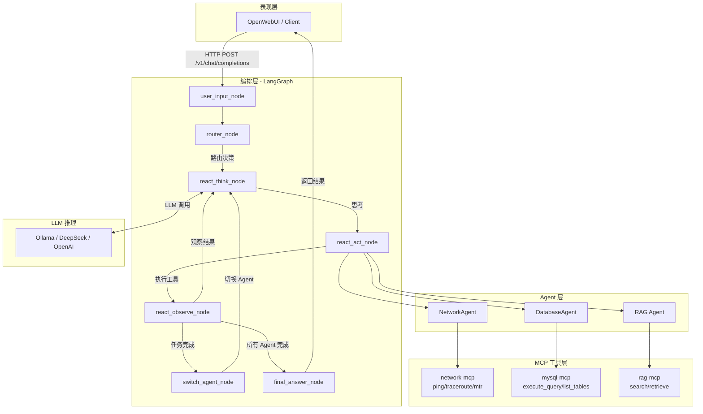
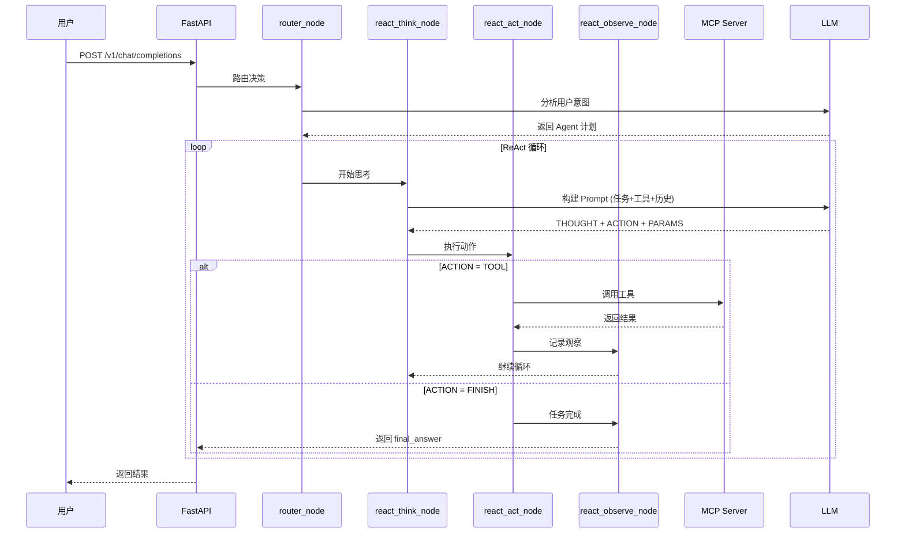
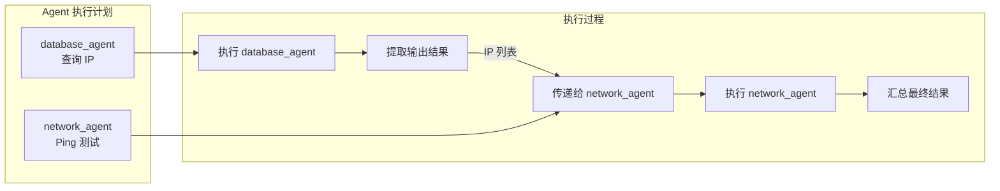
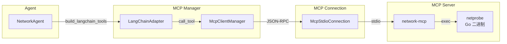

# AI Agent Network Tools

基于 LangGraph + LangChain + MCP 协议的智能网络诊断系统。

## 技术栈

### 核心框架

| 技术 | 版本要求 | 说明 |
|------|----------|------|
| Python | >= 3.11 | 运行环境 |
| LangGraph | >= 0.0.30 | 多 Agent 工作流编排 |
| LangChain | >= 0.1.0 | Agent 抽象与 LLM 集成 |
| FastAPI | >= 0.109.0 | HTTP API 服务 |
| MCP (Model Context Protocol) | >= 0.1.0 | 工具标准化接口协议 |

### LLM 支持

- **Ollama** - 本地模型推理 (DeepSeek, Qwen 等)
- **OpenAI** - GPT 系列模型
- **DeepSeek** - DeepSeek API
- **Google Gemini** - Gemini API

### 存储与工具

| 组件 | 说明 |
|------|------|
| ChromaDB | 向量数据库（RAG 检索） |
| MySQL | 数据库工具（通过 mcp-server-mysql） |
| netprobe (Go) | 网络诊断工具（ping/traceroute/mtr/nslookup） |

### 开发工具

- **uv** - Python 包管理器
- **loguru** - 日志系统
- **pydantic** - 数据校验
- **watchdog** - 配置文件热加载

## 安装过程

### 1. 克隆项目

```bash
git clone https://github.com/Matthewyin/nssa_aiagent.git
cd nssa_aiagent
```

### 2. 安装依赖

```bash
# 使用 uv 安装依赖
uv sync
```

### 3. 配置环境变量

```bash
# 复制环境变量模板
cp .env.example .env

# 编辑 .env 文件，配置以下内容：
# - LLM 配置 (OLLAMA_BASE_URL, DEEPSEEK_API_KEY 等)
# - MySQL 连接信息 (MYSQL_HOST, MYSQL_USER, MYSQL_PASSWORD 等)
# - 服务端口 (GRAPH_SERVICE_PORT)
```

### 4. 编译网络诊断工具

```bash
cd netprobe
go build -o netprobe ./cmd/main.go
cd ..
```

### 5. 安装 MCP Server

```bash
# MySQL MCP Server
uvx install mcp-server-mysql
```

### 6. 启动服务

```bash
bash scripts/restart_all.sh
```

### 7. 验证服务

- API 文档: `http://localhost:8765/docs`
- 健康检查: `http://localhost:8765/health`

## 架构设计

### 三层架构

```text
┌─────────────────────────────────────────────────────────────┐
│                      表现层 (UI Layer)                       │
│                    OpenWebUI / Web Client                    │
└──────────────────────────┬──────────────────────────────────┘
                           │ HTTP API (OpenAI Compatible)
                           ▼
┌─────────────────────────────────────────────────────────────┐
│                     编排层 (Orchestration)                   │
│                   LangGraph Graph Service                    │
│  ┌─────────────────────────────────────────────────────────┐ │
│  │ user_input → router → react_think → react_act → ...     │ │
│  │                          ↓                               │ │
│  │              react_observe → final_answer                │ │
│  └─────────────────────────────────────────────────────────┘ │
└──────────────────────────┬──────────────────────────────────┘
                           │ LangChain Agents
                           ▼
┌─────────────────────────────────────────────────────────────┐
│                     执行层 (Execution)                       │
│  ┌──────────────┐  ┌──────────────┐  ┌──────────────┐       │
│  │ NetworkAgent │  │DatabaseAgent │  │  RAG Agent   │       │
│  └──────┬───────┘  └──────┬───────┘  └──────┬───────┘       │
│         │ MCP Protocol    │ MCP Protocol    │ MCP Protocol  │
│         ▼                 ▼                 ▼               │
│  ┌──────────────┐  ┌──────────────┐  ┌──────────────┐       │
│  │ network-mcp  │  │ mysql-mcp    │  │  rag-mcp     │       │
│  │  (netprobe)  │  │              │  │ (chromadb)   │       │
│  └──────────────┘  └──────────────┘  └──────────────┘       │
└─────────────────────────────────────────────────────────────┘
```

### 目录结构

```text
.
├── graph_service/          # LangGraph 工作流服务
│   ├── main.py             # FastAPI 入口
│   ├── graph.py            # 工作流定义
│   ├── state.py            # 状态定义 (GraphState)
│   ├── openai_api.py       # OpenAI 兼容 API
│   └── nodes/              # 工作流节点
│       ├── router.py       # 路由节点
│       ├── react_think.py  # ReAct 思考节点
│       ├── react_act.py    # ReAct 执行节点
│       ├── react_observe.py # ReAct 观察节点
│       └── final_answer.py # 最终回答节点
├── agents/                 # Agent 实现
│   ├── base_agent.py       # 基础 Agent 类
│   ├── network_diag_agent.py # 网络诊断 Agent
│   └── database_agent.py   # 数据库 Agent
├── mcp_manager/            # MCP 客户端管理
│   ├── client_manager.py   # MCP 连接管理器
│   ├── stdio_connection.py # Stdio 连接实现
│   └── adapters/           # LangChain 适配器
├── mcp_servers/            # MCP Server 实现
│   ├── network_mcp/        # 网络诊断 MCP Server
│   └── rag_mcp/            # RAG MCP Server
├── netprobe/               # Go 网络诊断工具
│   └── cmd/                # ping/traceroute/mtr/nslookup
├── config/                 # 配置文件
│   ├── llm_config.yaml     # LLM 配置
│   ├── agent_config.yaml   # Agent 配置
│   ├── mcp_config.yaml     # MCP Server 配置
│   └── workflow_templates.yaml # 工作流模板
├── utils/                  # 工具模块
│   ├── config_loader.py    # 配置加载
│   ├── config_manager.py   # 配置管理器
│   └── logger.py           # 日志系统
└── scripts/                # 启动脚本
    └── restart_all.sh      # 重启服务
```

## 组件调用关系

### 整体流程



### ReAct 循环详细流程



### 多 Agent 串行执行



### MCP 工具调用



## 配置说明

### 配置文件结构

| 文件 | 说明 |
|------|------|
| `.env` | 环境变量（API Key、数据库连接等） |
| `config/llm_config.yaml` | LLM 配置（模型、温度、超时） |
| `config/agent_config.yaml` | Agent 配置（system_prompt、工具前缀） |
| `config/mcp_config.yaml` | MCP Server 配置（命令、参数） |
| `config/workflow_templates.yaml` | 工作流模板（关键词触发、多 Agent 编排） |

### 配置热加载

系统支持配置文件热加载，修改 YAML 配置文件后无需重启服务即可生效。

## 常用命令

```bash
# 启动服务
bash scripts/restart_all.sh

# 查看日志
tail -f data/logs/app.log

# 运行测试
uv run pytest tests/

# 格式化代码
uv run black .
uv run ruff check --fix .
```

## License

MIT
